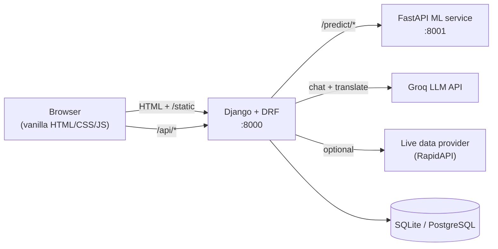

# RailSetu

A full-stack Indian Railways demo platform: search trains between stations, check live status and PNR, view coach and platform layouts, predict waitlist confirmation with machine learning, book multi-passenger tickets, and chat with a Groq-powered RAG assistant. Built with Django + DRF, a separate FastAPI ML service, and a dependency-free vanilla JavaScript frontend.

> **Demo data notice.** This is a portfolio project, not a real booking system. Indian Railways does not publish historical PNR/waitlist outcomes, live fares, or platform/coach maps as open data, so fares, seat availability, platforms, coach layouts, and the ML training data are **synthetically generated** from realistic domain rules. The engineering (APIs, auth, ML pipelines, background jobs) is real; the underlying numbers are simulated. No real travel is booked and no real payments are taken.

---

## Features

- **Train search** between any two stations with duration, type, and running days.
- **Live status & PNR** lookups (via an optional third-party provider; synthetic fallback otherwise).
- **Coach & platform view** with a visual seat/berth map per class.
- **Three ML models** (separate FastAPI service):
  - Waitlist **confirmation** probability (Gradient Boosting classifier).
  - Expected **delay** by day and train (Gradient Boosting regressor).
  - Train **ranking / match score** for a route (learning-to-rank regressor).
- **Fare & delay trend charts** on the train page.
- **Booking** with **multiple passengers on one PNR**, per-passenger berth allocation (confirmed → RAC → waitlist), and a downloadable PDF ticket.
- **Email** on booking and cancellation (console backend in dev, SMTP in prod).
- **Accounts**: JWT auth, plus **Google Sign-In** via the OAuth 2.0 redirect flow.
- **Saved** trains and routes, **price/seat alerts** with a background job, and per-user **recently viewed / search history**.
- **Admin analytics dashboard** (staff only): bookings, revenue, top routes, searches, model usage.
- **RAG chatbot** (Groq + TF-IDF retrieval + tool calling) that answers from a knowledge base and live tools.
- **Dark / light theme** and **multi-language UI** (English + Indian languages) translated on demand by Groq, with caching.

---

## Architecture

Three tiers. Django serves both the JSON API and the static frontend; the ML models live in their own FastAPI service that Django calls over HTTP.



**Tech stack:** Django 5, Django REST Framework, SimpleJWT, FastAPI, scikit-learn, pandas, ReportLab (PDF), Groq (LLM), vanilla JS (no build step).

---

## Project structure

```
railway-platform/
├── backend/                 # Django + DRF (port 8000); also serves the frontend
│   ├── apps/
│   │   ├── accounts/        # JWT auth, registration, Google OAuth redirect flow
│   │   ├── stations/        # station data + loader
│   │   ├── trains/          # train + schedule data + loaders
│   │   ├── search/          # train search
│   │   ├── booking/         # bookings, passengers, cancellation, PDF ticket, emails
│   │   ├── chat/            # RAG chatbot + Groq translation endpoint
│   │   ├── saved/           # saved trains / routes
│   │   ├── alerts/          # price/seat alerts + check_alerts background job
│   │   ├── analytics/       # usage events + admin dashboard API
│   │   └── history/         # per-user recently viewed / searches
│   ├── config/              # settings, urls, wsgi, asgi
│   ├── data/                # seed JSON (stations, trains, schedules)
│   ├── requirements.txt
│   └── .env.example
├── frontend/                # vanilla HTML/CSS/JS, served by Django (TemplateView + /static)
├── ml-service/              # FastAPI ML microservice (port 8001) + train_*.py scripts
└── README.md
```

---

## Getting started

**Prerequisites:** Python 3.11+, and (optionally) a free [Groq API key](https://console.groq.com/keys) for the chatbot and translation.

### 1. Backend (Django, port 8000)

```bash
cd backend
python -m venv .venv
.venv\Scripts\activate            # Windows
# source .venv/bin/activate       # macOS / Linux
pip install -r requirements.txt

copy .env.example .env            # Windows  (cp on macOS/Linux)
# open .env and set DJANGO_SECRET_KEY (and any keys you want); see the table below

python manage.py migrate
python manage.py load_stations    # import seed data
python manage.py load_trains
python manage.py load_schedule
python manage.py createsuperuser  # needed for the admin dashboard
python manage.py runserver
```

Open **http://localhost:8000**.

> Generate a secret key: `python -c "from django.core.management.utils import get_random_secret_key as k; print(k())"`

### 2. ML service (FastAPI, port 8001) — optional but powers predictions

```bash
cd ml-service
python -m venv .venv
.venv\Scripts\activate
pip install -r requirements.txt
python train.py            # confirmation model  (model.joblib)
python train_delay.py      # delay model         (model_delay.joblib)
python train_rank.py       # ranking model       (model_rank.joblib)
python -m uvicorn app:app --port 8001
```

The `.joblib` model files are git-ignored and regenerated by the `train_*.py` scripts.

### 3. Frontend

No build step. The frontend is plain HTML/CSS/JS in `frontend/`, served by Django from `/` and `/static/`. Just open the site once the backend is running.

---

## Environment variables

Copy `backend/.env.example` to `backend/.env` and fill what you need. Everything is optional except the secret key; features degrade gracefully when their key is missing.

| Variable | Purpose | Needed for |
| --- | --- | --- |
| `DJANGO_SECRET_KEY` | Django cryptographic key | Always |
| `DJANGO_DEBUG` | `1` for local dev, `0`/unset for production | Local dev |
| `DJANGO_ALLOWED_HOSTS` | Comma-separated hosts | Deploy |
| `DJANGO_CSRF_TRUSTED_ORIGINS` | HTTPS origins for CSRF | Deploy |
| `GROQ_API_KEY` | Groq LLM key | Chatbot + translation |
| `GOOGLE_CLIENT_ID` / `GOOGLE_CLIENT_SECRET` / `GOOGLE_REDIRECT_URI` | Google Sign-In | Google login |
| `EMAIL_BACKEND` + SMTP vars | Outgoing email (console by default) | Real emails |
| `LIVE_API_KEY` / `LIVE_API_HOST` | Third-party live data | Live status/PNR |
| `ML_SERVICE_URL` | FastAPI service URL | Predictions |

**Never commit `.env`.** It is git-ignored; commit only `.env.example`.

---

## Background job: alerts

Price/seat alerts are evaluated by a management command:

```bash
python manage.py check_alerts            # run once
python manage.py check_alerts --loop 60  # re-check every 60s
```

It flips an alert to *Triggered* when the fare drops to the target or the class shows availability. On a server, schedule the one-shot form (cron / Task Scheduler).

---

## Security notes

- All secrets are read from the environment; none are hardcoded in the repo.
- `DEBUG` defaults to **off**; production HTTPS hardening (secure cookies, HSTS, SSL redirect) activates automatically when `DEBUG` is off, and the app refuses to boot with the placeholder secret key.
- The Google **client secret**, **Groq key**, and any **email app password** live only in `.env`. If one is ever exposed, rotate it.

---

## Screenshots

_Add screenshots here (homepage, search results, train page with trend charts, booking, dashboard, chatbot, dark mode)._

```
docs/screenshots/  ← place images and link them here
```

---

## License

Released under the MIT License. Seed station/train data is derived from open datasets; fares, availability, platforms, coach maps, and ML training data are synthetic and for demonstration only.